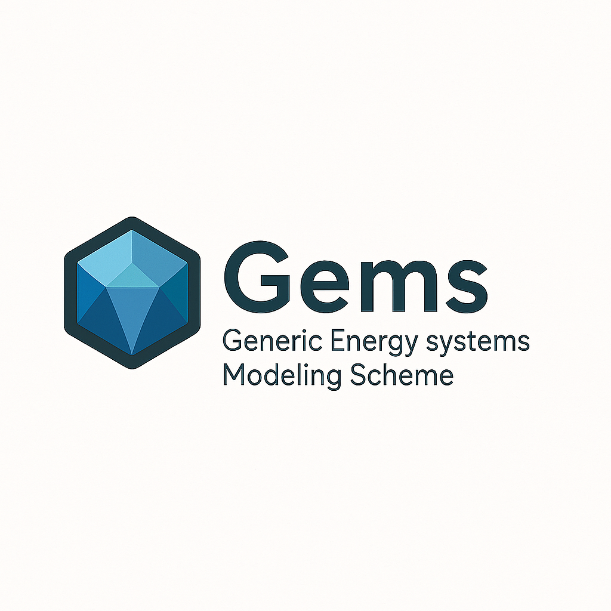

# GemsPy

GemsPy is an open-source tool, developed in Python, for the modelling and the simulation of complex energy systems under uncertainty. This is a generic interpreter for the [**Gems**](https://gemspy.readthedocs.io/en/latest/) modelling framework.

**Online documentation**: [gemspy.readthedocs.io](https://gemspy.readthedocs.io/en/latest/).

## The Gems framework

### The rationale behind Gems

**Gems** introduces a novel approach to model and simulate energy systems, centered around a simple principle: getting models out of the code.

To develop and test new models of energy system components, writing software code should not be a prerequisite. This is where the **Gems** framework excels, offering users a "no-code" modelling experience with unparalleled versatility.

### Gems = a high-level modelling language + a data structure

The Gems framework consists of a **high-level modelling language**, close to mathematical syntax, and a **data structure** for describing energy systems.

More specifically, [three main types of input files](https://gemspy.readthedocs.io/en/latest/user-guide/libraries/) can be defined with the **Gems** framework:

- [**Model libraries**](https://gemspy.readthedocs.io/en/latest/user-guide/libraries/): YAML files that describe abstract component models.  
- [**System files**](https://gemspy.readthedocs.io/en/latest/user-guide/systems/): YAML files that describe the graph of components of a system, with their (constant and time/scenario-dependent) numerical parameters: nodes in the graph represent instances of abstract models from the 'library', and vertices denote connections between components (as defined by 'ports').
- [**Timeseries files**](https://gemspy.readthedocs.io/en/latest/user-guide/data/): the data for time-/scenario-dependent parameters (.txt or .csv).

## The GemsPy package

This Python package features a generic interpreter of **Gems** capable of generating optimisation problems from any library and system files that adhere to the modelling language syntax. It then employs off-the-shelf optimisation solvers to solve these problems. The Python API facilitates reading case studies stored in YAML format, modifying them, or creating new ones from scratch by scripting.

The [Getting started](https://gemspy.readthedocs.io/en/latest/user-guide/getting-started/) page of the online documentation introduce you to the **Gems** input file format and the basics of the GemsPy API.

### Input files and code examples
More extensive examples are available on the repository:
- Examples of 'library' files, that describe abstract models, may be found in [src/andromede/libs](./src/andromede/libs).
- Examples of 'system' files, that describe test cases, may be found in [tests/e2e/models/andromede-v1/systems](./tests/e2e/models/andromede-v1/systems).
- Examples of GemsPy codes that load 'library' and 'system' files, interprets and simulates them may be found in [tests/e2e/models/andromede-v1/test_andromede_v1_models.py](./tests/e2e/models/andromede-v1/test_andromede_v1_models.py).

### Repository structure

The repository consists in:
- [src/andromede](./src/andromede):
  python package that implements the concepts (models, ports)
  and allows for simulation using them.
- [tests](./tests):
  python tests illustrating the use and behaviour of the concepts
- [models-design](./models-design):
  mainly schemas to design the models that one could implement
  using our concepts.

## Link with Antares Simulator software
The GemsPy package forms part of the Antares project, but its implementation is completely independent of that of the AntaresSimulator software. Although it was initially designed to prototype the next features of the Antares software (for more information, see [Antares Simulator documentation](https://antares-simulator.readthedocs.io/en/latest/user-guide/modeler/01-overview-modeler/), its structuring and development practices have resulted in high-quality, self-supporting code. It is currently maintained to offer the flexibility of the designed modelling language and interpreter to Python users and to continue exploring its potential. 
